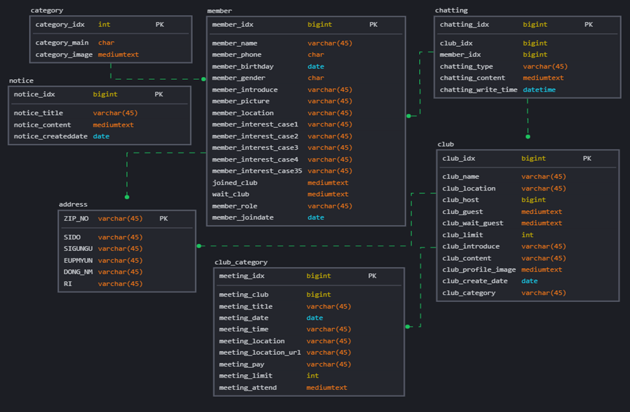

# Ulidongne Project

### Purpose

같은 동네에 동일한 취미, 관심사를 가진 사람들의 온/오프라인 일정 약속을 잡기 위한 안드로이드 어플리케이션 구현

### Development Environment

|              |                                                   |
| ------------ | ------------------------------------------------- |
| OS           | Windows 10                                        |
| Language     | Java, JavaScript, HTML/CSS, Kotlin                |
| Tool         | VS Code, SpringBoot, IntelliJ, Bootstrap5, Github |
| Server       | Tomcat 9                                          |
| DB           | MariaDB, AWS RDS                                  |
| Distribution | Github Actions, AWS Code Deploy, AWS S3, AWS EC2  |

### Database

### Functional Decomposition

| 페이지           | 세부기능             | 설명                                                       |
| ---------------- | -------------------- | ---------------------------------------------------------- |
| 메인화면         | 추천모임             | 내관심사와 동일한 모임 회원수 기준 추천                    |
|                  | 우리 동네 일정       | 우리동네 일정 출력                                         |
|                  | 신규 모임            | 최근 개설된 모임 추천                                      |
| 모임 상세 페이지 | 모임 가입            | 모임 가입 신청                                             |
|                  | 모임 탈퇴            | 모임 탈퇴                                                  |
|                  | 일정 참여/취소       | 일정 참여, 불참                                            |
|                  | 회원 채팅            | 같은 모임 회원간 채팅                                      |
|                  | 가입 승인/거절       | 모임장이 가입 신청 승인/ 거절                              |
| 더보기           | 내 정보 수정         | 내 정보 수정                                               |
|                  | 내 관심사 수정       | 관심사를 수정 (3~5개)                                      |
|                  | 가입한 모임 조회     | 내가 가입한 모임을 조회                                    |
| 위치 설정        | 위치 검색            | 모임, 회원 위치 등을 설정                                  |
| 모임 검색        | 키워드 검색          | 자신의 동네를 기준으로 키워드를 통해 모임을 검색           |
|                  | 관심사 + 키워드 검색 | 자신의 동네를 기준으로, 키워드와 관심사를 통해 모임을 검색 |
| 설정             | 공지사항             | 공지사항을 출력.                                           |
|                  | 회원탈퇴             | 회원에서 탈퇴                                              |
| 모임 만들기      | 모임 생성            | 모임을 생성                                                |
| 일정 만들기      | 일정 생성            | 해당 모임의 일정을 생성                                    |

### Demonstration

[우리동네 시연 영상](https://youtu.be/99-g5Yfwi38)

### Report

[완료 보고서](./우리동네%20완료보고서.pdf)

### Team Members

박선교 서호준 정희진
